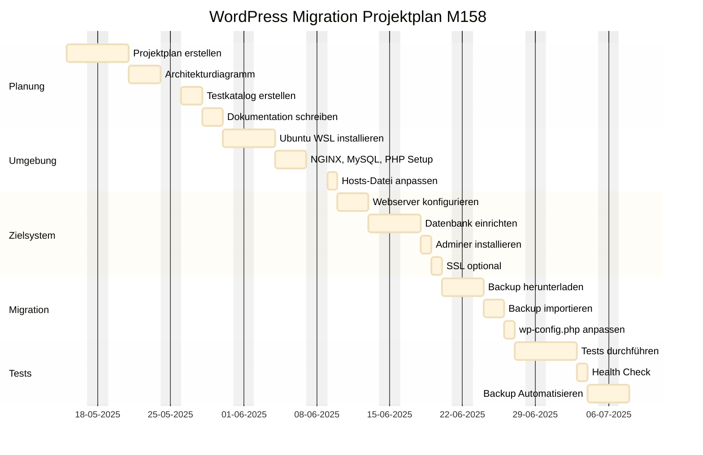

# Projektdokumentation – M158 LB2 WordPress-Migration

## Aufgabe 1 – Projektplan erstellen



## Aufgabe 2 – Architekturdiagramm erstellen


## Aufgabe 3 – AWS-Umgebung einrichten

### Stufe 3

  - EC2-Instanz mit **Ubuntu 22.04** aufgesetzt

  - Zugriff per SSH mit Key-Authentifizierung funktioniert (miljkovic.pem)

  - Planung vollständig umgesetzt ***(Security Group, VPC, Subnetz, Elastic IP)***

## Aufgabe 4 – DNS-Konfiguration

### Stufe 3

  - Domainauflösung über **/etc/hosts** eingerichtet: ```34.232.75.121  miljkovic-m158.local```

## Aufgabe 5 – Webserver konfigurieren

### Stufe 3

  - Apache Virtual Host konfiguriert

  - mod_rewrite aktiviert

  - HTTP → HTTPS-Weiterleitung eingerichtet

  - Keine Apache Default Page sichtbar

## Aufgabe 6 – PHP einrichten

### Stufe 3

  - PHP 8.3 verwendet

  - php.ini angepasst (z. B. upload_max_filesize, post_max_size etc.)

  - PHP-FPM aktiviert (FastCGI Process Manager)

## Aufgabe 7 – MySQL/MariaDB aufsetzen

### Stufe 3

  - Root-Zugriff nur über localhost

  - WordPress-User mit eingeschränkten Rechten erstellt

  - Dedicated Container für MariaDB

## Aufgabe 8 – Web-Datenbanktool (phpMyAdmin/Adminer)

### Stufe 3

phpMyAdmin im eigenen Container

Erreichbar unter ```http://miljkovic-m158.local:8888```

Zugriff erfolgt über HTTPS mit selbst signiertem Zertifikat

## Aufgabe 9 – FTP-Zugang einrichten

### Stufe 3

FTPS-Zugriff eingerichtet (vsftpd + TLS)

Benutzer mit Zugriff nur auf /var/www/html und Unterverzeichnisse

Sichere Konfiguration mit verschlüsselter Übertragung

## Aufgabe 10 – WordPress migrieren

### Stufe 3

Alle Dateien nach /var/www/html kopiert, Rechte korrekt gesetzt (www-data)

Datenbank erfolgreich importiert, inkl. Anpassung von Domainnamen

wp-config.php angepasst

WP_HOME und WP_SITEURL in der Datenbank aktualisiert

Admin-Login funktioniert (Passwort ggf. via SQL auf MD5-Hash gesetzt)

## Aufgabe 11 – Backup-Konzept umsetzen

### Stufe 3

Backup-Skript mit cron eingerichtet

Datenbank- und Datei-Backup erfolgt täglich

Alte Backups werden automatisch gelöscht (Rotation)

Backup-Skript verschickt E-Mail mit msmtp (SMTP konfiguriert mit Gmail)

## Aufgabe 12 – Testing der Webapplikation

### Stufe 3

Mind. 10 spezifische Testfälle erstellt und getestet (z. B. Login, Upload, Beiträge erstellen)

Seite /wp-admin/site-health.php zeigt "Sollte verbessert werden" (min. akzeptabel)

Seite et_support_center_divi getestet (Permissions gefixt, Pfade angepasst)

## Aufgabe 13 – Deployment automatisieren

### Stufe 3

CI/CD-Pipeline mit GitLab CI erstellt

Deploy auf Staging- und Live-Umgebung bei Commit auf main bzw. staging

Automatischer docker-compose up -d --build

## Aufgabe 14 – Docker verwenden

### Stufe 3

Docker Compose verwendet

Alle Services als Container (Apache+PHP, MariaDB, phpMyAdmin, FTP, WordPress)

Volumes für Datenpersistenz, Secrets/Env-Vars für Sicherheit

