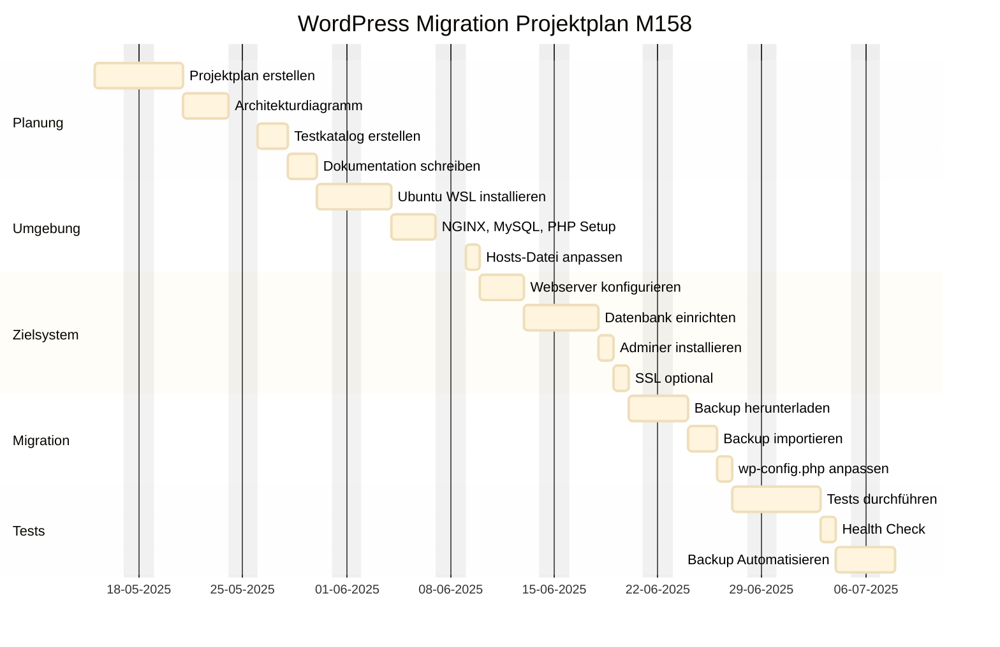

# Projektdokumentation – M158 LB2 WordPress-Migration

## Aufgabe 1 – Projektplan erstellen

## Aufgabe 2 – Architekturdiagramm erstellen

## Aufgabe 3 – AWS-Umgebung einrichten

### Stufe 1

Fügen Sie hier Ihre Ergebnisse ein

### Stufe 2

Fügen Sie hier Ihre Ergebnisse ein

---

## Aufgabe 4 – DNS-Konfiguration

Ändern Sie die Stufe, für die Sie sich entschieden haben, selbst.

### Stufe ?

Fügen Sie hier Ihre Ergebnisse ein

---

## Aufgabe 5 – Webserver konfigurieren

### Stufe 1

Fügen Sie hier Ihre Ergebnisse ein

### Stufe 2

Fügen Sie hier Ihre Ergebnisse ein

### Stufe 3

Fügen Sie hier Ihre Ergebnisse ein

---

## Aufgabe 6 – PHP einrichten

### Stufe 1

Fügen Sie hier Ihre Ergebnisse ein

### Stufe 2

Fügen Sie hier Ihre Ergebnisse ein

### Stufe 3

Fügen Sie hier Ihre Ergebnisse ein

---

## Aufgabe 7 – MySQL/MariaDB aufsetzen

### Stufe 1

Fügen Sie hier Ihre Ergebnisse ein

### Stufe 2

Fügen Sie hier Ihre Ergebnisse ein

### Stufe 3

Fügen Sie hier Ihre Ergebnisse ein

---

## Aufgabe 8 – Web-Datenbanktool (phpMyAdmin/Adminer)

### Stufe 1

Fügen Sie hier Ihre Ergebnisse ein

### Stufe 2

Fügen Sie hier Ihre Ergebnisse ein

### Stufe 3

Fügen Sie hier Ihre Ergebnisse ein

---

## Aufgabe 9 – FTP-Zugang einrichten

### Stufe 1

Fügen Sie hier Ihre Ergebnisse ein

### Stufe 2

Fügen Sie hier Ihre Ergebnisse ein

---

## Aufgabe 10 – WordPress migrieren

### Stufe 1

Fügen Sie hier Ihre Ergebnisse ein

### Stufe 2

Fügen Sie hier Ihre Ergebnisse ein

### Stufe 3

Fügen Sie hier Ihre Ergebnisse ein

---

## Aufgabe 11 – Backup-Konzept umsetzen

### Stufe 1

Fügen Sie hier Ihre Ergebnisse ein

### Stufe 2

Fügen Sie hier Ihre Ergebnisse ein

---

## Aufgabe 12 – Testing der Webapplikation

### Stufe 1

Fügen Sie hier Ihre Ergebnisse ein

### Stufe 2

Fügen Sie hier Ihre Ergebnisse ein

### Stufe 3

Fügen Sie hier Ihre Ergebnisse ein

---

## Aufgabe 13 – Deployment automatisieren

### Stufe 1

Fügen Sie hier Ihre Ergebnisse ein

### Stufe 2

Fügen Sie hier Ihre Ergebnisse ein

### Stufe 3

Fügen Sie hier Ihre Ergebnisse ein

---

## Aufgabe 14 – Docker verwenden

### Stufe 1 - 3

Fügen Sie hier Ihre Ergebnisse ein

---

