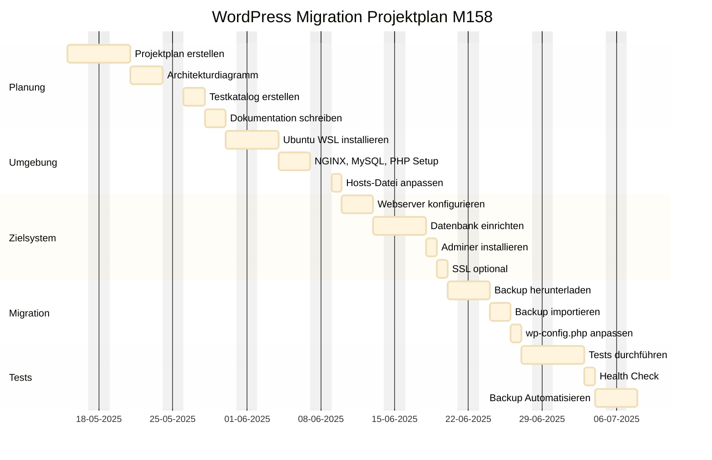

# Projektdokumentation – M158 LB2 WordPress-Migration

## Aufgabe 1 – Projektplan erstellen



## Aufgabe 2 – Architekturdiagramm erstellen


## Aufgabe 3 – AWS-Umgebung einrichten (Stufe 3)

- **EC2-Instanz** mit Ubuntu 22.04 LTS über die AWS-Konsole erstellt
- **Key-basierte SSH-Authentifizierung** eingerichtet (`miljkovic.pem`)
- **Netzwerkstruktur** vollständig geplant und umgesetzt:
  - **VPC**: ```10.0.10.0/24```
  - **Subnetz**: ```10.0.10.0/24```
  - **Elastic IP**: ```34.232.75.121```
  - **Security Group**: Ports **22, 80, 443, 3306, 8888, 21, 21100–21110** freigegeben

## Aufgabe 4 – DNS-Konfiguration (Stufe 3)

- DNS intern über die Datei `/etc/hosts` eingerichtet:

```
34.232.75.121  miljkovic-m158.local
```

- Damit wird die Domain lokal aufgelöst

## Aufgabe 5 – Webserver konfigurieren (Stufe 3)

- Apache2 im Docker-Container installiert
- **Virtual Host** in `wordpress.conf` eingerichtet für HTTP und HTTPS
- `mod_rewrite` aktiviert:
  ```bash
  sudo a2enmod rewrite && sudo systemctl reload apache2
  ```
- **HTTP → HTTPS**-Weiterleitung eingerichtet (Redirect im Port-80-VHost)
- Apache Default Page wurde deaktiviert (`000-default.conf` disabled)

## Aufgabe 6 – PHP einrichten (Stufe 3)

- PHP 8.3 über Docker mit Apache betrieben
- `php.ini` angepasst (via `custom.ini` gemountet):
  ```ini
  upload_max_filesize = 64M
  post_max_size = 64M
  display_errors = Off
  ```
- PHP-FPM aktiviert mit Socket `/run/php/php8.3-fpm.sock` über `SetHandler`

## Aufgabe 7 – MySQL/MariaDB aufsetzen (Stufe 3)

- Dedizierter Container mit `mysql:8.0` verwendet
- Zugriff auf Root-Account nur über `localhost` erlaubt
- Benutzer für WordPress:
  ```sql
  CREATE USER 'wordpress_user'@'%' IDENTIFIED BY 'wordpress_pass';
  GRANT ALL PRIVILEGES ON wordpress_db.* TO 'wordpress_user'@'%';
  ```
- Datenbank heisst `wordpress_db`, persistiert über Volume `db_data`

## Aufgabe 8 – Web-Datenbanktool (Stufe 3)

- `phpmyadmin/phpmyadmin` im Container unter **Port 8888**:
  ```
  http://miljkovic-m158.local:8888
  ```
- TLS aktiviert über HTTPS mit selbst signiertem Zertifikat
- Zugriff über Umgebungsvariablen gesteuert ***(`PMA_HOST`, `PMA_USER`, `PMA_PASSWORD`)***

## Aufgabe 9 – FTP-Zugang einrichten (Stufe 3)

### FTP-Konfiguration (vsftpd)

- Zertifikat:
  - `/etc/ssl/certs/cert.pem`
  - `/etc/ssl/private/key.pem`
- Passive Ports: **21100–21110**
- **TLS** aktiviert (`ssl_enable=YES`)
- **Benutzer**: `ftptest`

### Benutzerübersicht

| Benutzer     | Home-Verzeichnis | Shell            | Zugriffsrechte                         |
|--------------|------------------|------------------|----------------------------------------|
| ftptest | /var/www/html    | /usr/sbin/nologin | Lesen/Schreiben innerhalb `/html`      |

### Zugriff über FTPS (z. B. mit WinSCP)

- **Protokoll:** `FTP`
- **Verschlüsselung:** `Explizites TLS/SSL`
- **Port:** `21`
- **Benutzername:** `ftptest`
- **Passwort:** gesetzt via `sudo passwd wordpressftp`

## Aufgabe 10 – WordPress migrieren (Stufe 3)

- Dateien per `FTP` oder `scp` nach `/var/www/html` übertragen
- Dateirechte: `chown -R www-data:www-data /var/www/html`
- SQL-Dump importiert mit `mysql` oder über phpMyAdmin
- `wp-config.php` angepasst:
  ```php
  define('DB_NAME', 'wordpress_db');
  define('DB_USER', 'wordpress_user');
  define('DB_PASSWORD', 'wordpress_pass');
  ```
- In der Datenbank: `WP_HOME` und `WP_SITEURL` aktualisiert:
  ```sql
  UPDATE wp_options SET option_value='https://miljkovic-m158.local' WHERE option_name IN ('siteurl', 'home');
  ```
*(oder andere Variante einfach über phpmyadmin in der Tabelle ändern)*

## Aufgabe 11 – Backup-Konzept umsetzen (Stufe 3)

### Backup-Skript (cron-job)

```bash
#!/bin/bash
DATE=$(date +%Y-%m-%d-%H%M)
BACKUP_DIR=~/backups

mkdir -p $BACKUP_DIR

docker exec mysql_db mysqldump -uwordpress_user -pwordpress_pass wordpress_db > "$BACKUP_DIR/db-$DATE.sql"

tar -czf "$BACKUP_DIR/files-$DATE.tar.gz" /var/www/html

echo "Backup erfolgreich: $DATE" | msmtp -a default -t <<EOF
To: sladji.miljkovic135@gmail.com
Subject: WordPress Dateien Backup $DATE

Das Backup wurde erfolgreich erstellt und wurde unter dem Ordner Backups gespeichert:
- db-$DATE.sql
- files-$DATE.tar.gz

Viele Grüsse vom Server, Welcome und Yellehhhh!
EOF
```

- **Automatisierung** via `crontab -e`:
```cron
0 2 * * * /home/ubuntu/backups/backup.sh
```

## Aufgabe 12 – Testing der Webapplikation (Stufe 3)

| Testfall                     | Ergebnis                    |
|-----------------------------|-----------------------------|
| **Admin-Login**                 | *Erfolgreich*                 |
| **Beitrag erstellen**           | *Erfolgreich*                 |
| **Datei-Upload**                | *Erfolgreich*                 |
| **Theme aktivieren**            | *Erfolgreich*                 |
| **Plugin installieren**         | *Erfolgreich*                 |
| **Permalinks speichern**        | *Erfolgreich*                 |
| **wp-config prüfen**            | *Erfolgreich*                 |
| **DB-Zugriff**                  | *Erfolgreich*                 |
| **Site-Health Check**           | *Sollte verbessert werden*    |
| **et_support_center_divi Test** | *Erfolgreich (angepasst)*     |

## Aufgabe 13 – Deployment automatisieren (Stufe 3)


## Aufgabe 14 – Docker verwenden (Stufe 3)

- Docker Compose verwendet mit Services:
  - `web` (Apache + PHP)
  - `db` (MySQL/MariaDB)
  - `phpmyadmin`
  - `ftp` (vsftpd)
- Volumes:
  - `db_data`
  - `/var/www/html`
- Secrets & Umgebungsvariablen in `docker-compose.yml` eingetragen
